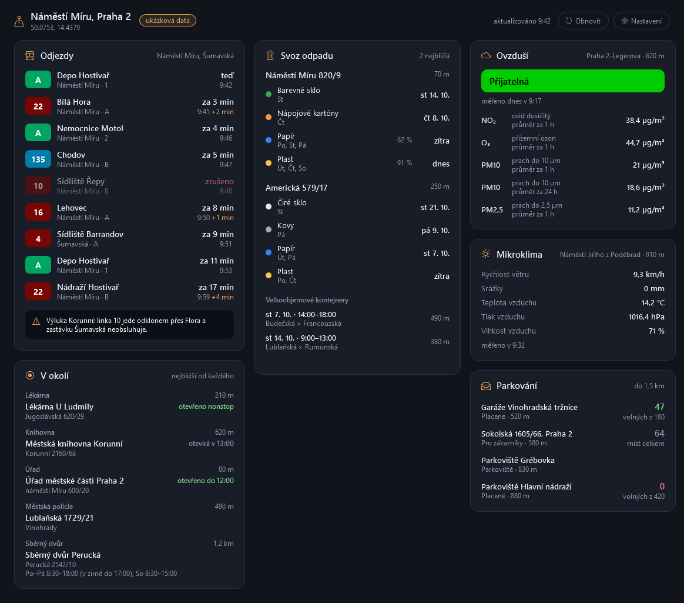
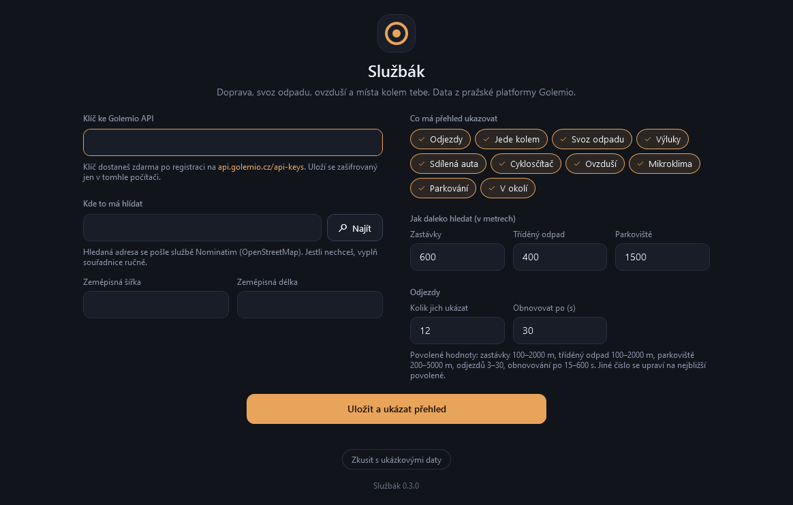

<p align="center">
  
</p>

<h1 align="center">Službák</h1>

<p align="center">
  Praha kolem tebe v jednom okně: odjezdy a vozidla MHD, výluky, parkování, svoz odpadu a ovzduší.
</p>

<p align="center">
  
</p>

Zadáš svůj klíč ke [Golemio API](https://api.golemio.cz/docs/openapi/) a adresu. Službák pak ukazuje, co se
děje v okolí, a sám se obnovuje. Vyzkoušeno se skutečným klíčem i daty (říjen 2026).

- **Nic se neinstaluje ani nekompiluje.** Skript v PowerShellu a okno v XAML. Všechno, co potřebuje, už ve
  Windows je.
- **Data se nikam neukládají.** Aplikace je jen stáhne a ukáže. Na disku má jediný soubor s nastavením.
- **Klíč zůstává u tebe.** Ukládá se zašifrovaný a posílá se jen na `api.golemio.cz`.
- **Jde to zkusit i bez klíče.** Tlačítko **Zkusit s ukázkovými daty** ukáže přehled pro náměstí Míru
  s vymyšlenými daty, bez internetu.

## Co ukazuje

Všechno je na jedné stránce ve třech sloupcích; co se do okna nevejde, je o kousek níž. Pod názvem místa je
i městská část, ve které leží.

| Karta | Co v ní je | Odkud |
| --- | --- | --- |
| Odjezdy | nejbližší odjezdy ze zastávek do 600 m, zpoždění, zrušené spoje, mimořádnosti na zastávce | `/v2/gtfs/stops`, `/v2/pid/departureboards` |
| Právě jede kolem | tramvaje, autobusy a metro do 1 km: linka, kam jede, směr jízdy, zpoždění | `/v2/public/vehiclepositions`, `/v2/public/gtfs/trips` |
| Svoz odpadu | tři nejbližší stanoviště tříděného odpadu do 400 m, dny svozu, příští svoz, zaplnění podle senzoru | `/v2/sortedwastestations` |
| | velkoobjemové kontejnery do 1,5 km, které teprve přijedou | `/v1/bulky-waste/stations` |
| Výluky a mimořádnosti | co PID právě hlásí v celé síti, kterých zastávek se to týká a do kdy | `/v3/pid/infotexts` |
| Sdílená auta | pět nejbližších volných aut do 1,5 km: provozovatel, palivo, dostupnost | `/v2/sharedcars` |
| Cyklosčítač | kolik kol dnes projelo kolem nejbližšího sčítače, po směrech | `/v2/bicyclecounters` |
| Ovzduší | index kvality a naměřené látky z nejbližší stanice ČHMÚ | `/v2/airqualitystations` |
| Mikroklima | teplota, vlhkost, tlak, vítr a srážky z nejbližšího městského senzoru, který měří | `/v2/microclimate/points`, `/v2/microclimate/measurements` |
| Parkování | šest nejbližších parkovišť do 1,5 km, volná místa, kde se měří, a nejbližší parkovací automat | `/v3/parking`, `/v3/parking-measurements`, `/v3/parking-machines` |
| V okolí | nejbližší lékárna, nemocnice, knihovna, úřad, služebna městské policie, sběrný dvůr, hřiště a zahrada | `/v2/medicalinstitutions`, `/v2/municipallibraries`, `/v2/municipalauthorities`, `/v2/municipalpolicestations`, `/v2/wastecollectionyards`, `/v2/playgrounds`, `/v2/gardens` |

**Každá karta jde sbalit.** Klikni na její záhlaví (nebo na něm zmáčkni mezerník) a zůstane z ní jen řádek
s názvem; dalším kliknutím ji rozbalíš. Sbalená karta se nestahuje a po rozbalení se načte. Co máš sbalené,
si aplikace pamatuje. Kartu, kterou nechceš vidět vůbec, vypneš v nastavení; sloupec, ve kterém žádná
nezbude, se zavře.

Vzdálenosti v tabulce jsou výchozí; okruh pro zastávky, tříděný odpad a parkoviště si v nastavení změníš.

Odjezdy a vozidla se obnovují každých 30 sekund (jde změnit), všechno ostatní každých 10 minut. Tlačítko
**Obnovit** a klávesa F5 načtou hned odjezdy a vozidla; ostatní odpovědi si aplikace 10 minut pamatuje
a dřív se pro ně na síť nejde. Minimalizované okno nestahuje nic a po návratu se obnoví hned.

## Instalace

1. Stáhni [Sluzbak.zip](https://github.com/JohnyLeeJohnes/sluzbak/releases/latest/download/Sluzbak.zip).
   Odkaz vede vždy na nejnovější verzi; starší jsou na stránce
   [Releases](https://github.com/JohnyLeeJohnes/sluzbak/releases).
2. Klikni na stažený ZIP pravým tlačítkem, zvol **Vlastnosti**, dole zaškrtni **Odblokovat** a potvrď.
3. Rozbal ho tam, kde má aplikace zůstat, třeba do Dokumentů.
4. Ve složce `Sluzbak` poklepej na **`install.cmd`**. Vytvoří zástupce **Službák** s ikonou v nabídce
   Start, na ploše a přímo ve složce. Přes něj se aplikace spouští jako každá jiná, bez okna konzole.

> **Proč odblokovat?** Windows si soubory stažené z internetu označí a u skriptů s tímhle označením se ptá,
> jestli je má spustit, nebo je rovnou odmítne (Smart App Control ve Windows 11). Když ZIP odblokuješ ještě
> před rozbalením, označení se na rozbalené soubory nepřenese.

- **Jen vyzkoušet:** poklepej na `Sluzbak.cmd`, spustí aplikaci bez vytváření zástupců.
- **Nová verze:** stáhni ji stejně a rozbal přes tu starou. Nastavení zůstane, je uložené jinde. Kterou
  verzi máš, je napsané dole na obrazovce nastavení.
- **Přechod z GolemWatch:** tak se aplikace jmenovala do verze 0.3.0. Rozbal Službák vedle a spusť
  `install.cmd`: starého zástupce nahradí novým. Nastavení i s klíčem se při prvním spuštění přestěhuje
  samo. Starou složku `GolemWatch` pak smaž.
- **Přesunutí složky:** zástupce ukazuje tam, kde aplikace leží. Po přesunutí spusť `install.cmd` znovu.
- **Odebrání:** smaž zástupce z plochy a z nabídky Start, celou složku a `%APPDATA%\Sluzbak`.
- **Z gitu:** `git clone https://github.com/JohnyLeeJohnes/sluzbak.git` a pak rovnou krok 4. Klonování
  označení z internetu nepřidává, takže odblokování odpadá.

Potřebuješ Windows 10 nebo 11 (Windows PowerShell 5.1 je jejich součástí). Vyzkoušeno na Windows 11.

## První spuštění

<p align="center">
  
</p>

1. **Klíč.** Zdarma po registraci na [api.golemio.cz/api-keys](https://api.golemio.cz/api-keys). Než se
   uloží, aplikace si ho u Golemia ověří.
2. **Místo.** Napiš adresu a dej **Najít** nebo Enter. První nalezená adresa se rovnou vyplní; když nesedí,
   klikni v seznamu na jinou (nebo ji vyber šipkami) a do pole se propíše ona i se souřadnicemi. Další
   Enter ukládá. Souřadnice jdou vyplnit i ručně (projde `50.0753` i `50,0753`). Text v poli s adresou se
   zároveň použije jako název místa v přehledu.
3. **Volby.** Nic z toho vyplňovat nemusíš, všechno má výchozí hodnotu:
   - které karty má přehled ukazovat (vypnutá karta se ani nestahuje),
   - jak daleko hledat zastávky (100–2000 m), tříděný odpad (100–2000 m) a parkoviště (200–5000 m),
   - kolik odjezdů ukázat (3–30) a jak často je obnovovat (15–600 s).

Aplikace si všechno pamatuje a příště otevře rovnou přehled. Změníš to kdykoli tlačítkem **Nastavení**
v přehledu.

## Dobré vědět

- **Co kam odchází.** Klíč a souřadnice jdou jen na `api.golemio.cz`. Adresa, kterou hledáš, jde službě
  [Nominatim](https://nominatim.openstreetmap.org/) (OpenStreetMap), a to jen po kliknutí na **Najít**.
  Když souřadnice vyplníš ručně, nikam jinam se nic neposílá.
- **Kde je nastavení.** V `%APPDATA%\Sluzbak\settings.json`: klíč, název místa, souřadnice, volby a to,
  které karty máš sbalené. Klíč šifruje Windows (DPAPI), takže ho přečte jen tvůj účet na tomhle počítači.
  Na jiném počítači ho zadáš znovu.
  Dočasná složka (`%TEMP%`) by nestačila: Windows ji při úklidu maže a aplikace by nastavení zapomněla.
- **Šetří API.** Golemio dovoluje 20 dotazů za 8 sekund na jeden klíč. Aplikace si dotazy počítá a když by
  limit překročila, chvilku počká. Hlavně se ale neptá zbytečně: odpovědi si pamatuje (měření, svozy,
  obsazenost a místa 10 minut, odjezdy a polohy vozidel 10 sekund, číselníky a zastávky kolem tebe po celou
  dobu běhu). Mačkání **Obnovit**, rozbalení karty ani uložení nastavení tak nic nestahují znovu. Paměť je
  jen v běžící aplikaci, na disk se nic neukládá.
- **Karty dole naskočí o pár sekund později.** První načtení všech karet je kolem 34 dotazů, tedy víc, než
  limit pustí naráz. Nejdřív se proto načtou odjezdy, vozidla, odpad, výluky, ovzduší a mikroklima a teprve
  po nich parkování, místa v okolí, sdílená auta a cyklosčítač; na zbytek z nich se čeká, než se limit po
  osmi sekundách uvolní. Opakované načtení do deseti minut je žádný až tři dotazy.
- **Kam vozidla jedou, se doplní nakonec.** Cíl každého vozidla je dotaz navíc, takže se na ně ptá, až když
  je v limitu místo. Do té doby karta ukazuje linky, zpoždění a vzdálenost.
- **Barvy u odpadu jsou barvy kontejnerů:** modrá papír, žlutá plasty a nápojové kartony, zelená barevné
  sklo, bílá čiré sklo, šedá kovy, červená elektro, fialová jedlé oleje (podle víka nádoby). Žlutému
  kontejneru říká Golemio „Multikomoditní sběr“; aplikace píše rovnou, co do něj patří. Směsný odpad (černé
  popelnice) v datech o tříděném odpadu není.
- **Co běžný klíč nesmí.** K některým datům Golemio pouští jen na požádání (`golemio@operatorict.cz`). Klíč
  z registrace neprošel (zkoušeno 5. 10. 2026) k velkoobjemovým kontejnerům, sdíleným kolům, dopravním
  omezením, intenzitě dopravy, sčítačům chodců, hlášení závad ani k energetice. Velkoobjemové kontejnery
  aplikace umí a s klíčem, který na ně smí, je ukáže; bez něj tu část karty schová. Ostatní z toho v aplikaci
  nejsou, protože je nebylo na čem vyzkoušet.
- **Ovzduší a mikroklima.** Měření ovzduší starší než 6 hodin se jako aktuální neukáže; karta napíše, z kdy
  je poslední. Senzory mikroklimatu Golemiu od dubna 2026 žádná data neposílají, takže karta zatím jen
  říká, že čerstvá data nejsou. Jakmile začnou chodit, ukáže je.
- **Když Golemio chvíli neodpovídá.** Některé dotazy trvají napoprvé i desítky sekund. Dotaz se jednou
  zopakuje a karta, která se nespojila, to za půl minuty zkusí sama znovu.
- **První hledání zastávek chvíli trvá.** API neumí vrátit zastávky podle polohy, takže se jednou po spuštění
  stáhne jejich celý seznam.
- **Když karta selže, ostatní jedou dál.** Chyba se ukáže přímo v kartě. Stará data se při chybě schovají,
  aby prošlý odjezd nevypadal jako aktuální.
- **Časy odjezdů, svozů a měření jsou pražské,** ať je počítač nastavený jakkoli.
- **Proč skript, a ne `.exe`.** Nepodepsaný `.exe` umí Windows 11 (Smart App Control) zablokovat. Skript
  běží bez podpisu a před spuštěním si ho můžeš celý přečíst.

## Úpravy

| Soubor | Obsah |
| --- | --- |
| `Sluzbak.ps1` | Chování okna: nastavení, načítání na pozadí, obnovování, vytvoření zástupců. |
| `Sluzbak.xaml` | Vzhled okna: barvy, styly, karty. |
| `Golemio.ps1` | Čtení dat z Golemio API a hledání adres. Bez okna, dá se zkoušet samostatně. |
| `demo/` | Ukázkové odpovědi API pro náměstí Míru. |
| `Sluzbak.cmd`, `install.cmd` | Spuštění bez instalace a vytvoření zástupců. |
| `tools/make-icon.ps1` | Vygeneruje ikonu do `assets/`. |
| `tools/make-release.ps1` | Sestaví ZIP pro stránku Releases do `dist/`. |
| `tests/unit.ps1` | Testy čtení dat nad ukázkovými odpověďmi. |
| `tests/e2e.ps1` | Test, který aplikaci prokliká přes UI Automation. |
| `tests/keys.ps1` | Test klávesnice v nastavení (Enter, šipky, kliknutí na nalezenou adresu), pořadí načítání a sbalování karet. |
| `tests/live.ps1` | Zkouška naživo: načte všechny karty ze skutečného API a vypíše, co která dostala. |

Chceš jiné barvy? Celá paleta je na začátku `Sluzbak.xaml`. Změny se projeví při dalším spuštění, nic se
nesestavuje.

Testy se pouští takhle:

```
powershell -ExecutionPolicy Bypass -File tests/unit.ps1
```

```
powershell -ExecutionPolicy Bypass -File tests/e2e.ps1
```

```
powershell -ExecutionPolicy Bypass -File tests/keys.ps1
```

Žádný z nich nevolá síť a nepotřebuje klíč. Druhý a třetí během běhu otevřou okno aplikace a pracují
s nastavením v dočasné složce, takže na to tvoje nesáhnou.

Se skutečným klíčem jde všechno projít naráz. Skript si klíč a místo vezme z nastavení aplikace, takže ji
nejdřív jednou spusť a nastav:

```
powershell -ExecutionPolicy Bypass -File tests/live.ps1
```

U každé karty vypíše, kolik čeho dostala, nebo chybu. Klíč nevypisuje.

Aplikace jde pustit i s ukázkovými daty místo sítě a umí uložit obrázek svého okna:

```
powershell -ExecutionPolicy Bypass -File Sluzbak.ps1 -Demo
```

```
powershell -ExecutionPolicy Bypass -File Sluzbak.ps1 -Demo -Screenshot docs\prehled.png
```

Změny se zapisují do [CHANGELOG.md](CHANGELOG.md).

## Licence

[MIT](LICENSE)

---

**In English:** Službák is a small Windows desktop dashboard on top of Prague's Golemio open-data API. Enter
your own API key and an address, and it shows nearby public-transport departures and vehicles, service
alerts, parking, shared cars, a bicycle counter, waste collection days, nearby amenities, air quality and
microclimate sensors. It is a PowerShell script with a WPF window: download
[Sluzbak.zip](https://github.com/JohnyLeeJohnes/sluzbak/releases/latest/download/Sluzbak.zip) (always the
latest version), unblock and extract it, and run `install.cmd` to get a shortcut. Nothing to compile or
install. Nothing is stored except your settings. The interface is in Czech.
